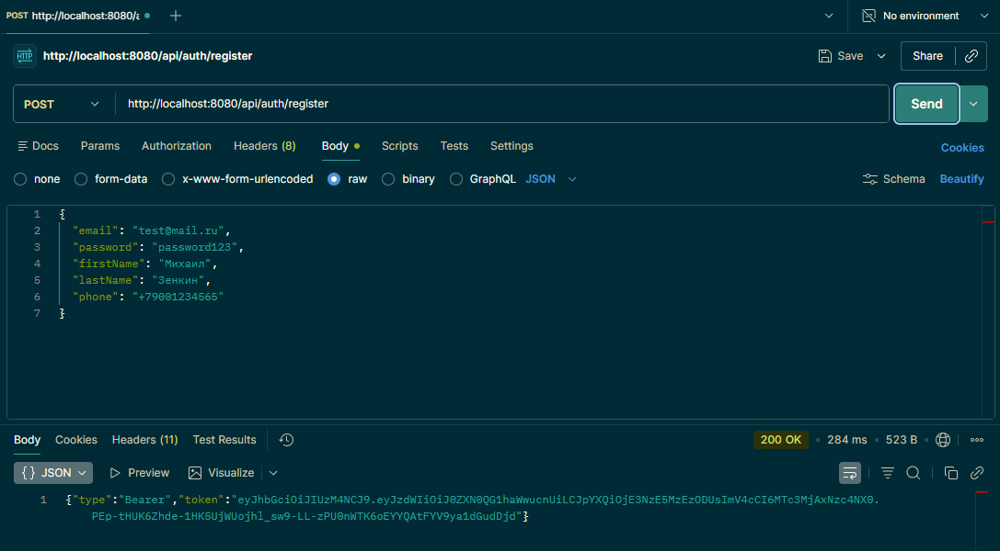
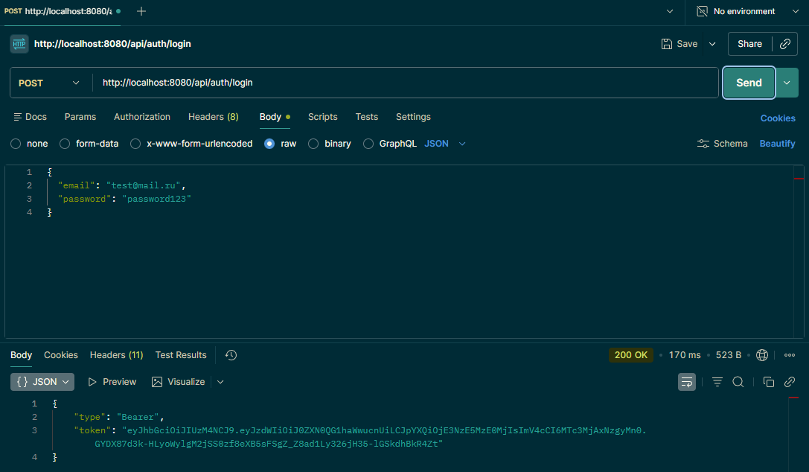
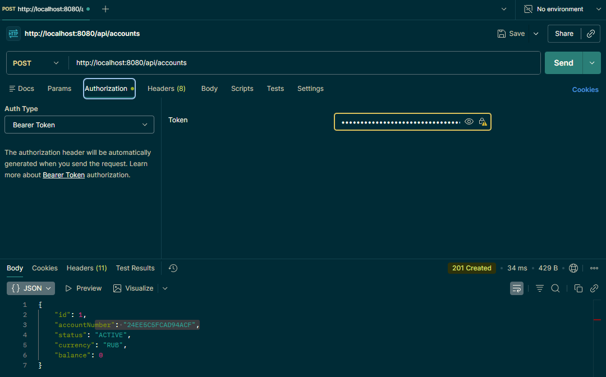
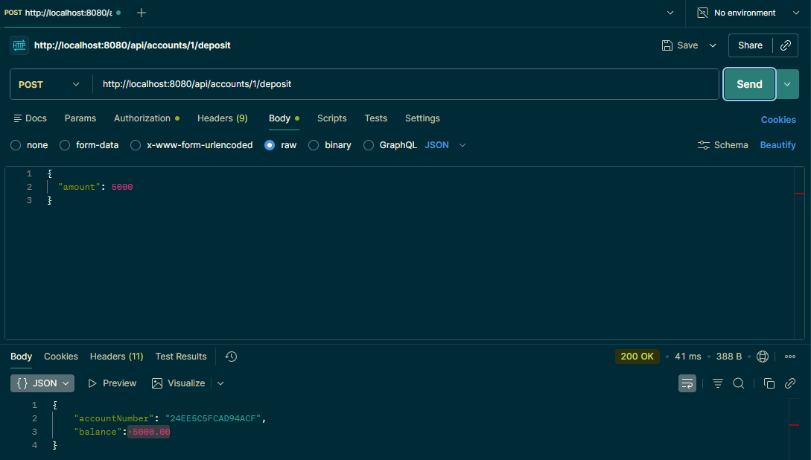
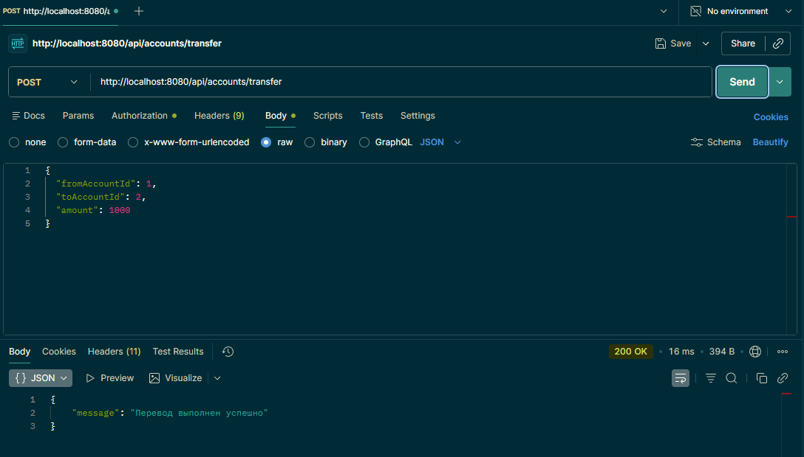
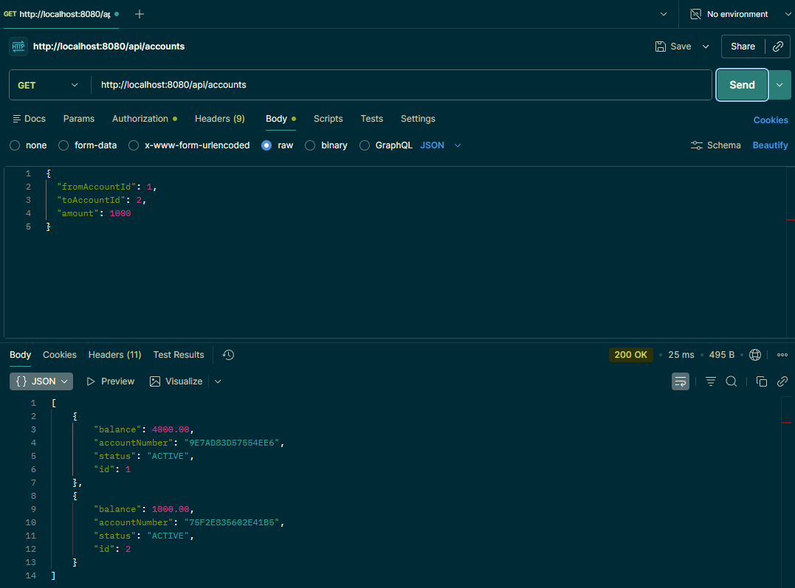

# Banking API

> REST API банковского приложения - Pet-проект


---
Banking API - это полноценный backend сервис банковского приложения.  
Реализована регистрация пользователей, авторизация через JWT токены,  
управление счетами и переводы между ними с полной историей транзакций.
---
| Технология           | Описание |
|----------------------|----------|
| **Java 21**          | Основной язык |
| **Spring Boot 4.0.3** | Фреймворк приложения |
| **Spring Security**  | Аутентификация и авторизация |
| **JWT**   | Stateless токены |
| **Spring Data JPA**  | Работа с базой данных |
| **Hibernate**        | ORM маппинг |
| **PostgreSQL**       | Основная база данных |
| **H2**               | In-memory БД для разработки |
| **Lombok**           | Уменьшение boilerplate кода |
| **Maven**            | Сборка проекта |

---

## Функциональность

- Регистрация и вход с выдачей JWT токена
- Создание банковских счетов
- Пополнение счёта
- Переводы между счетами с проверкой баланса
- История транзакций с пагинацией
- Защита эндпоинтов - доступ только к своим счетам
- Запись каждой операции в историю транзакций

---

## API Endpoints

### Auth
| Метод | URL | Описание |
|-------|-----|----------|
| `POST` | `/api/auth/register` | Регистрация нового пользователя |
| `POST` | `/api/auth/login` | Вход и получение токена |

### Accounts
| Метод | URL | Описание |
|-------|-----|----------|
| `POST` | `/api/accounts` | Создать новый счёт |
| `GET` | `/api/accounts` | Получить все свои счета |
| `POST` | `/api/accounts/{id}/deposit` | Пополнить счёт |
| `POST` | `/api/accounts/transfer` | Перевод между счетами |
| `GET` | `/api/accounts/{id}/transactions` | История операций |

---

## Демонстрация

### Регистрация и получение токена


### Логин


### Создание счёта


### Пополнение счёта


### Перевод между счетами


### Счёты


---

## Безопасность

- Пароли хешируются через **BCrypt**
- Аутентификация через **JWT Bearer токен**
- Каждый запрос проходит через **JwtAuthFilter**
- Пользователь имеет доступ **только к своим счетам**
- **Stateless** сессии - сервер не хранит состояние
---

## Запуск проекта

### С H2 (для разработки - ничего не нужно устанавливать)

```bash
git clone https://github.com/Michael-merlot/banking-api.git
cd banking-api
mvn spring-boot:run
```

Приложение запустится на `http://localhost:8080`  
H2 консоль доступна на `http://localhost:8080/h2-console`

### Переменные окружения

```yaml
jwt.secret=ключ
jwt.expiration=86400000
```

---